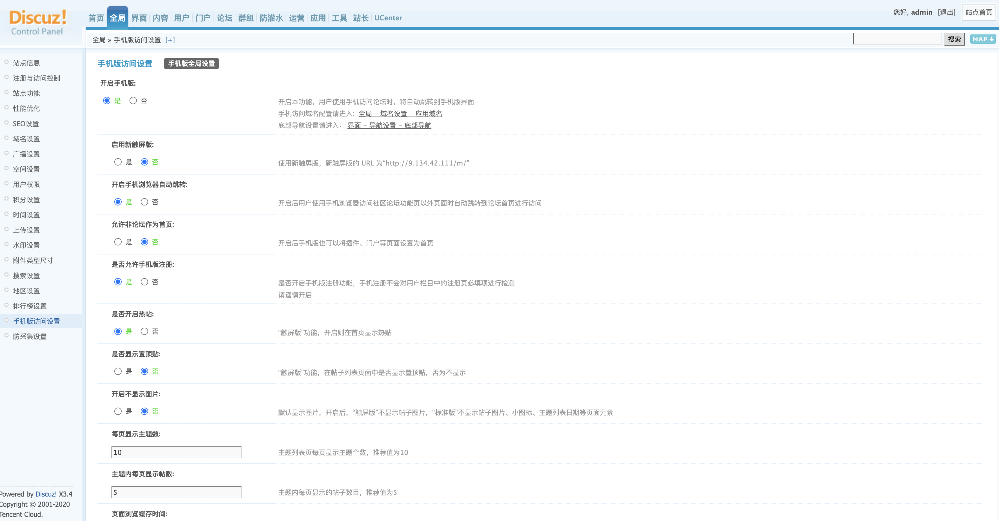
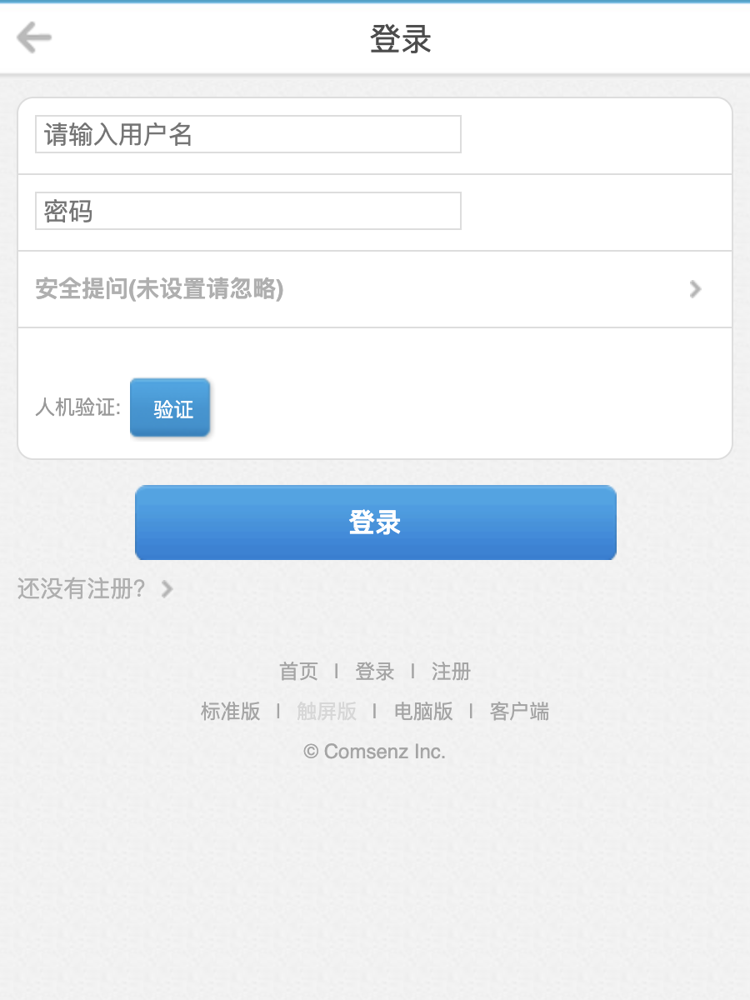
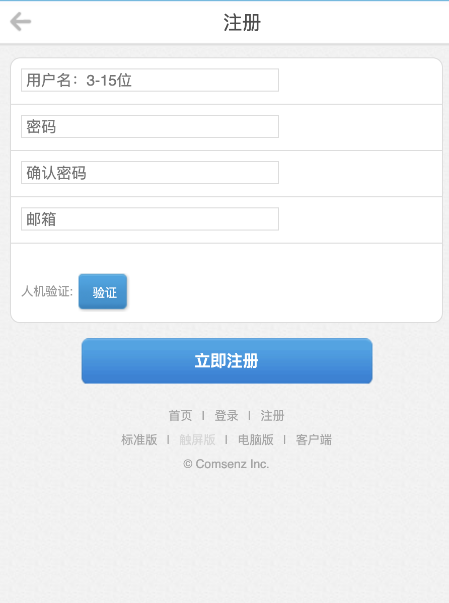
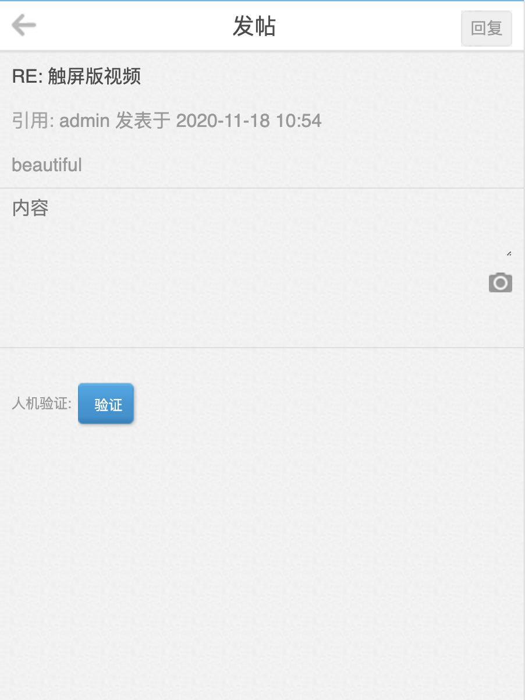

# 腾讯云验证码插件
## 0.版本依赖

- 依赖 PHP 5.5+ 环境

- 如果有其它插件引用了 GuzzleHttp 库并低于 6.3.0 版本会引起插件冲突导致站点无法使用

## 1.插件介绍

> tencentcloud_captcha插件是一款腾讯云研发的，提供给Discuz! X站长使用的官方插件。基于原有的验证码基础上提供腾讯云验证码机制进行安全验证。

| 标题       | 名称                                                         |
| ---------- | ------------------------------------------------------------ |
| 中文名称   | 腾讯云验证码（CAPTCHA）插件                                  |
| 英文名称   | tencentcloud_captcha                                         |
| 最新版本   | v1.0.3 (2020.11.17)                                          |
| 适用平台   | [Discuz! X3.4](https://www.discuz.net/forum.php)                |
| 适用产品   | [腾讯云验证码](https://cloud.tencent.com/document/product/1110/36334)             |
| GitHub项目 | [tencentcloud-discuzx-plugin-captcha](https://github.com/Tencent-Cloud-Plugins/tencentcloud-discuzx-plugin-captcha) |
| 主创团队   | 腾讯云中小企业产品中心（SMB Product Center of Tencent Cloud） |

## 2.功能特性

- 在Discuz! X上提供腾讯云的增强版验证码功能
- 支持登录、注册腾讯云验证码验证功能
- 支持评论、发帖腾讯云验证码验证功能
- 支持修改密码、充值卡密腾讯云验证码验证功能
- 支持触屏版腾讯云验证码验证功能
- 支持触屏版登录、注册腾讯云验证码验证功能
- 支持触屏版评论、回复评论腾讯云验证码验证功能
  

## 3.安装指引

### 3.1.部署方式一：通过GitHub部署安装

> 1. git clone https://github.com/Tencent-Cloud-Plugins/tencentcloud-discuzx-plugin-captcha.git。
> 2. 复制tencentcloud-captcha 文件夹 到Discuz! X安装路径/source/plugin/文件夹里面。

### 3.2.插件更新方式一：在Discuz! X的应用中心更新
> 1. 登录网站后台->应用->应用中心，打开应用中心页面（并登录验证），搜索腾讯云验证码。
> 2. 点击安装应用，如果没有绑定qq则需先绑定qq。

### 3.3.插件更新方式二：通过GitHub最新代码更新
> 1. 登录网站后台->应用->插件，关闭并卸载腾讯云验证码插件。
> 2. git clone https://github.com/Tencent-Cloud-Plugins/tencentcloud-discuzx-plugin-captcha.git
> 3. 复制tencentcloud-captcha 文件夹 到Discuz! X安装路径/source/plugin/文件夹里面。
> 4. 登录网站后台->应用->插件，安装并开启腾讯云验证码插件。

## 4.使用指引

### 4.1. 页面功能介绍

> 验证码设置页面，本插件已接入系统的验证码模块，开启后请前往系统后台-防灌-验证设置进行具体场景的验证码配置。

> 开启验证码之后的效果。

> 开启手机版访问设置。

> 手机版登录时验证码效果。

> 手机版注册时验证码效果。

> 手机版回复评论时验证码效果。
### 4.2. 名词解释

- **自定义密钥**：插件提供统一密钥管理，在多个腾讯云插件时可以共享SecretId和SecretKey，支持各插件自定义密钥。

- **SecretId**：在腾讯云云平台API密钥上申请的标识身份的 SecretId,用于身份验证。详情参考[腾讯云文档](https://cloud.tencent.com/document/product)。

- **SecretKey**：在腾讯云云平台API密钥上申请的标识身份的SecretId对应的SecretKey，用于身份验证。详情参考[腾讯云文档](https://cloud.tencent.com/document/product)。

- **CaptchaAppId**： 在腾讯云短信验证码控制台应用的应用ID，该应用ID默认应用全部场景。详情参考[腾讯云文档](https://cloud.tencent.com/document/product)。

- **CaptchaAppSecretKey**： 在腾讯云短信验证码控制台应用的密钥，需和应用ID匹配。详情参考[腾讯云文档](https://cloud.tencent.com/document/product)。

## 5.获取入口

| 插件入口 | 链接                                                         |
| -------- | ------------------------------------------------------------ |
| GitHub   | [link](https://github.com/Tencent-Cloud-Plugins/tencentcloud-discuzx-plugin-captcha) |
| 插件中心  | [link](https://addon.dismall.com/plugins/tencentcloud_captcha.html) |

## 6.FAQ

> 1. 腾讯云验证码插件安装并启动后，在进行验证的时候总是提示"验证码错误"？
- **回答**：1 确定开通了腾讯云验证码服务；2 插件的配置信息确定填写正确；3 如果有开启其他腾讯云插件，先关闭其他插件再试；4 卸载并安装最新版本。

> 2. 安装插件后无法启动插件？
- **回答**：可能是PHP版本太低，建议升级到PHP7以上的版本。

> 3. 出现 "Oops! System file lost: class/class_*.php"?
- **回答**：可能是PHP版本太低，建议升级到PHP7以上的版本。

> 4. 同时安装了腾讯云验证码插件和腾讯云文本内容安全插件，开启插件后验证码插件无法使用?
- **回答**：可能插件版本太低，请卸载已安装的腾讯云验证码插件和腾讯云文本内容安全插件，到应用中心或GitHub上获取最新的插件代码进行安装。

> 5. 在安装验证码插件的时候，报数据库错误"1293"？
- **回答**：可能是数据库版本版本太低，建议Mysql5.6以上的版本。
## 7.GitHub版本迭代记录

### 7.1 tencentcloud-discuzx-plugin-captcha v1.0.0

- 在Discuz! X上提供腾讯云的增强版验证码功能
- 支持登录、注册腾讯云验证码验证功能
- 支持评论、发帖腾讯云验证码验证功能
- 支持修改密码、充值卡密腾讯云验证码验证功能

### 7.2 tencentcloud-discuzx-plugin-captcha v1.0.3

- 支持触屏版腾讯云验证码验证功能
- 支持触屏版登录、注册腾讯云验证码验证功能
- 支持触屏版评论、回复评论腾讯云验证码验证功能
## 8.致谢

> 该插件参考了Discuz! X插件[reCAPTCHA云验证码](https://github.com/popcorner/discuz_recaptcha) 的实现方法，特此对其主创团队进行致谢。

---

本项目由腾讯云中小企业产品中心建设和维护，了解与该插件使用相关的更多信息，请访问[春雨文档中心](https://openapp.qq.com/docs/DiscuzX/captcha.html) 

请通过[咨询建议](https://da.do/y0rp) 向我们提交宝贵意见。