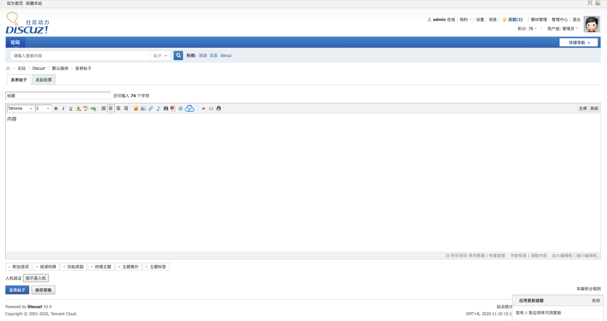

# 腾讯云验证码插件

## 1.插件介绍

> tencentcloud_captcha插件是一款腾讯云研发的，提供给Discuz! X站长使用的官方插件。基于原有的验证码基础上提供腾讯云验证码机制进行安全验证。

| 标题       | 名称                                                         |
| ---------- | ------------------------------------------------------------ |
| 中文名称   | 腾讯云验证码（CAPTCHA）插件                                  |
| 英文名称   | tencentcloud_captcha                                         |
| 最新版本   | v1.0.0 (2020.07.17)                                          |
| 适用平台   | [Discuz! X](https://www.discuz.net/forum.php)                |
| 适用产品   | [腾讯云验证码](https://www.discuz.net/forum.php)             |
| GitHub项目 | [tencentcloud-discuzx-plugin-captcha](https://github.com/Tencent-Cloud-Plugins/tencentcloud-discuzx-plugin-captcha) |
| 主创团队   | 腾讯云中小企业产品中心（SMB Product Center of Tencent Cloud） |
| 反馈地址   | 请通过[咨询建议](https://support.qq.com/products/164613)向我们提交宝贵意见  |

## 2.功能特性

- 在Discuz! X上提供腾讯云的增强版验证码功能

- 支持登录、注册腾讯云验证码验证功能

- 支持评论、发帖腾讯云验证码验证功能

- 支持修改密码、充值卡密腾讯云验证码验证功能

  

## 3.安装指引

### 3.1.部署方式一：通过GitHub部署安装

> 1. git clone https://github.com/Tencent-Cloud-Plugins/tencentcloud-discuzx-plugin-captcha.git
> 2. 复制tencentcloud-captcha 文件夹 到Discuz! X安装路径/source/plugin/文件夹里面

## 4.使用指引

### 4.1. 页面功能介绍

> 验证码设置页面，本插件已接入系统的验证码模块，开启后请前往系统后台-防灌-验证设置进行具体场景的验证码配置。

> 开启验证码之后的效果。

### 4.2. 名词解释

- **自定义密钥**：插件提供统一密钥管理，在多个腾讯云插件时可以共享SecretId和SecretKey，支持各插件自定义密钥。

- **SecretId**：在腾讯云云平台API密钥上申请的标识身份的 SecretId,用于身份验证。详情参考[腾讯云文档](https://cloud.tencent.com/document/product)。

- **SecretKey**：在腾讯云云平台API密钥上申请的标识身份的SecretId对应的SecretKey，用于身份验证。详情参考[腾讯云文档](https://cloud.tencent.com/document/product)。

- **CaptchaAppId**： 在腾讯云短信验证码控制台应用的应用ID，该应用ID默认应用全部场景。详情参考[腾讯云文档](https://cloud.tencent.com/document/product)。

- **CaptchaAppSecretKey**： 在腾讯云短信验证码控制台应用的密钥，需和应用ID匹配。详情参考[腾讯云文档](https://cloud.tencent.com/document/product)。

  

## 5.获取入口

| 插件入口 | 链接                                                         |
| -------- | ------------------------------------------------------------ |
| GitHub   | [link](https://github.com/Tencent-Cloud-Plugins/tencentcloud-discuzx-plugin-captcha) |

## 6.FAQ

> 暂无

## 7.GitHub版本迭代记录

### 7.1 tencentcloud-discuzx-plugin-captcha v1.0.0

- 在Discuz! X上提供腾讯云的增强版验证码功能
- 支持登录、注册腾讯云验证码验证功能
- 支持评论、发帖腾讯云验证码验证功能
- 支持修改密码、充值卡密腾讯云验证码验证功能

## 8.致谢

> 该插件参考了Discuz! X插件[reCAPTCHA云验证码](https://github.com/popcorner/discuz_recaptcha) 的实现方法，特此对其主创团队进行致谢。

---

本项目由腾讯云中小企业产品中心建设和维护，了解与该插件使用相关的更多信息，请访问[春雨文档中心](https://openapp.qq.com/docs/Chevereto/cos.html) 

请通过[咨询建议](https://da.do/y0rp) 向我们提交宝贵意见。